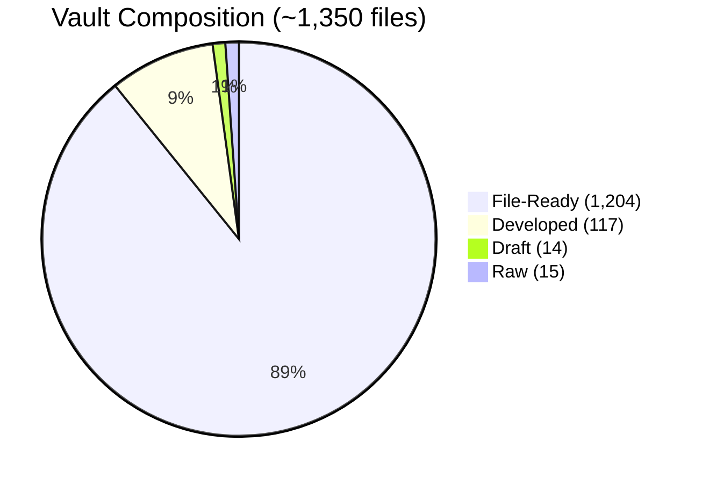
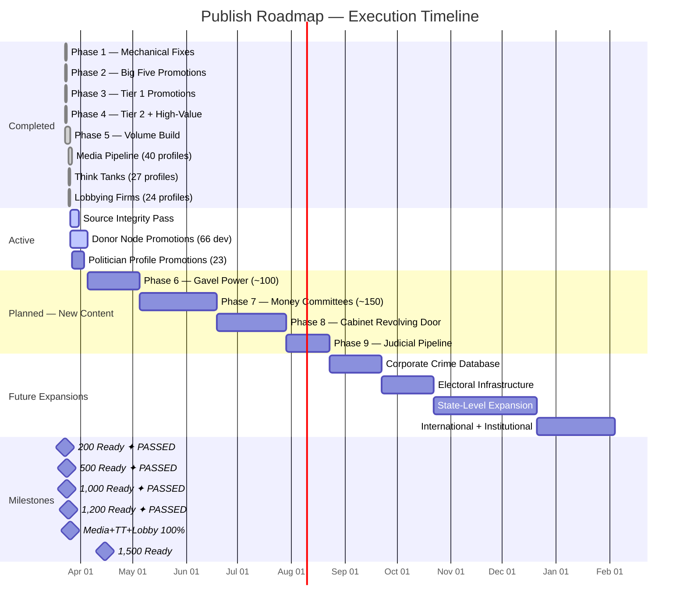
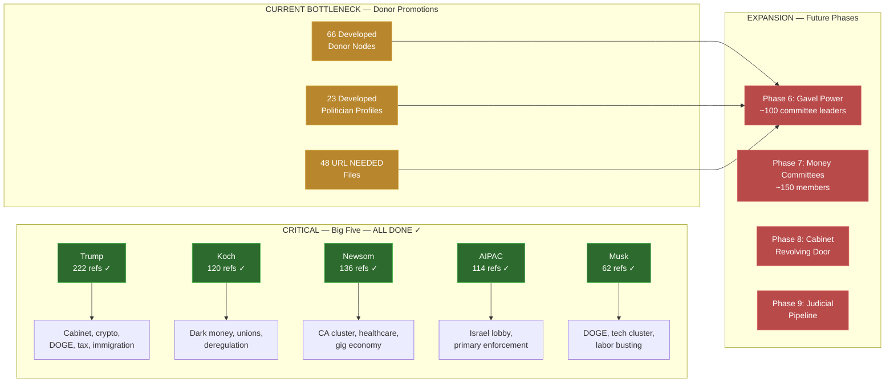

### The Donor Map Database — Publish Roadmap

**Created:** March 23, 2026 · **Last major revision:** April 1, 2026
**Purpose:** Master execution plan for the vault. Current status, completed work, active priorities, future phases, infrastructure, and timeline — all in one place.
**End goal:** Every relevant politician profiled, every donor node documented, every media pipeline mapped, every think tank funded by the same donors exposed. The complete model of how money controls American politics.

---

### Vault Status Dashboard

### Terminology (precise definitions — agents must use these terms)

- **File-ready:** A single file's `content-readiness` has reached `ready` per Quality Standards gates
- **Section-ready:** All files in a vault section have reached `ready`
- **Publish-ready:** Vault meets ALL public launch criteria (93%+ file-ready rate, zero UNVERIFIED/URL NEEDED tags in content files, no orphan notes)
- **Scope-complete:** All phases (1-12) finished. The defined universe is fully built. Long-term target.



### Overall Progress

```
File-Ready   ████████████████████████████████████████████░░░░░░  1,204 / 1,350  (89.2%)
Publish-Ready: NO — source integrity issues expanded (UNVERIFIED backlog from research merges), 93%+ rate not met
Scope-Complete: NO — Phases 6-12 not started (~450-1,650 files remaining)
```

**Note (April 1):** Ready count dropped from 1,219 to ~1,204 because 15 files were honestly downgraded from `ready` to `developed` after deep research merges added UNVERIFIED URLs. This is correct behavior per Quality Standards — adding unverified sources to a ready file requires downgrade. Chrome URL verification will recover these.

### By Section

| Section | Total | Ready | Dev | Draft | Raw | Ready % | Status |
|---------|-------|-------|-----|-------|-----|---------|--------|
| **Politicians** | 714 | 687 | 26 | 0 | 1 | 96.2% | Core backbone (3 Manchin files downgraded) |
| **Donors & Power Networks** | 433 | 339 | 81 | 1 | 12 | 78.3% | Largest section — 12 files downgraded from research merges |
| **Stories & Investigations** | 100 | 84 | 1 | 13 | 2 | 84.0% | Analytical layer |
| **Media & Influence Pipeline** | 55 | 46 | 9 | 0 | 0 | 83.6% | Phase 3 expansion ongoing |
| **Think Tanks & Policy Infrastructure** | 27 | 27 | 0 | 0 | 0 | **100%** | ✅ Complete — expansion planned (policy opposition mapping) |
| **Lobbying Firms & K Street** | 24 | 24 | 0 | 0 | 0 | **100%** | ✅ Complete |

### Broken Links & Source Gaps

| Issue | Count | Where |
|-------|-------|-------|
| Files with `(UNVERIFIED)` source tags | ~22+ | Expanded — 15 files from research merges + 4 pre-existing + new files |
| Content files with `(URL NEEDED)` tags | 48 | Mostly donor nodes and sub-notes |
| Total source integrity issues | ~70+ | Blocks full publish-readiness — Chrome verification pass needed |

### What's Below Ready (128 files)

| Category | Count | What They Need |
|----------|-------|----------------|
| Developed politician profiles | 23 | Citation pass, formatting, gap-filling |
| Developed donor nodes | 66 | Content expansion, source verification |
| Developed media profiles | 9 | Chrome URL verification, FEC API lookups |
| Draft stories | 13 | Substantial writing + sourcing |
| Raw files | 15 | Full builds from scratch |
| Other developed | 2 | Miscellaneous |

---

### Mission Statement

The Donor Map is a donor-first model of American politics. It documents who funds whom and what they got for their money — every connection sourced, every claim cited, every pipeline mapped. The end product is a navigable database that a journalist, researcher, congressional staffer, or engaged citizen can use to see the full board at once: the donors, the politicians they fund, the policies that result, and the class interests that drive all of it.

This is not a blog. This is not opinion. This is an evidence base with an analytical framework.

**Core thesis:** Donors control politicians, not the other way around. Every profile in this vault uses a class analysis lens — who benefits, who pays. Politicians are understood through their funding.

**Expansion thesis (March 2026):** The same donors who fund politicians also fund media personalities who manufacture consent, think tanks that generate policy language, and lobbying firms that deliver the ask. The Donor Map now tracks all four pipelines.

---

### Ready Notes Progress

```
Current  █████████████████████████████████████████████████░░  1,219
1,200    ██████████████████████████████████████████████████░  1,200  ← PASSED ✓
1,500    █████████████████████████████████████████░░░░░░░░░  1,500  ← NEXT (281 away)
2,000    █████████████████████████████████░░░░░░░░░░░░░░░░░  2,000

Passed:  Beta (78) ✓ · 100 ✓ · Soft Launch (130) ✓ · 200 ✓ · 300 ✓ · 500 ✓ · 750 ✓ · 1,000 ✓ · 1,200 ✓
```

### Phase Progression



---

### The Bottleneck Map



---

### Completed Phases — Historical Record

These phases are done. Kept here for reference and to show the build trajectory.

### Phase 1: Mechanical Fixes — COMPLETE ✓ (Session 38f, March 23)

Fixed everything that didn't require research: 134 wikilink aliases across 104 files, 18 placeholder donor nodes, 162 draft→developed promotions, 144 bold→### header conversions, 87 source citations standardized. Zero broken links in ready notes after this pass.

### Phase 2: The Big Five — COMPLETE ✓ (Session 38h, March 23)

Promoted the five most-referenced notes: Trump (222 refs), Koch (120 refs), Newsom (136 refs), AIPAC (114 refs), Musk (62 refs). Cleared ~75 dead links, unlocked California + Trump + Israel + tech/DOGE clusters.

### Phase 3: Tier 1 Promotions — COMPLETE ✓ (Session 38h, March 23)

All 13 high-impact notes (3+ ready refs each): Lockheed Martin, GEO Group, CoreCivic, Peter Thiel, Crypto Industry Bloc, JD Vance, Kash Patel, UnitedHealth, Blue Shield of CA, IBEW, Timothy Mellon, MAGA Inc, Elizabeth Warren. Cleared ~50 more dead links.

### Phase 4: Tier 2 + High-Value — MOSTLY COMPLETE (Session 38j)

12 of 13 promoted: Netanyahu, Haim Saban, UDP, David Sacks, ExxonMobil, Boeing, PhRMA, Bernie Sanders, Kamala Harris, Nancy Pelosi, Chad Bianco, plus pre-Phase 4 promotions (Harlan Crow, Jeffrey Yass, Robert Mercer, Paul Singer, SEIU). Remaining: Anthem - Elevance Health (needs expansion).

### Phase 5: Volume Build — NEAR COMPLETE (Sessions 38-50)

The workhorse phase. ~630+ promotions total: 105 individual promotion passes, 19 new donor node builds from raw→ready, ~500 automated/bulk promotions. Sessions 40-43 shifted from promotion passes to full research-and-build assembly lines. Every donor node category populated. Three new sections built to 100%: Media Pipeline (40 files), Think Tanks (27 files), Lobbying Firms (24 files).

**Phase 5 stragglers still pending:**
- Anthem - Elevance Health (developed, needs expansion)
- Pete Hegseth and Marc Andreessen stale duplicate cleanup
- 23 developed politician profiles needing promotion passes
- 66 developed donor nodes needing content expansion

---

### Sections Completed at 100%

Three entire sections reached full publish-readiness during Sessions 50-60. These represent the expansion of the Donor Map beyond the politician-donor backbone into the parallel pipelines that manufacture consent and generate policy.

### Media & Influence Pipeline — 40 files, 100% ready

Built Sessions 50-60. Tracks media personalities who receive money and use their platforms to push policy outcomes — the propaganda arm of the donor-to-policy pipeline. 38 profiles across Right (Tucker Carlson, Tim Pool, Steven Crowder, Ben Shapiro, Charlie Kirk, others), Left (Cenk Uygur, Hasan Piker, Pod Save America, Ethan Klein, others), and Centrist (Joe Rogan, Megyn Kelly, Bill Maher, Lex Fridman, others). Every profile includes FEC API-verified individual contribution data, standardized FEC Record sections, class analysis, and capture architecture mapping. Framework and Index files complete. Architecturally isolated from main vault — one-way wikilinks only, separate YAML type, clean deletion possible.

### Think Tanks & Policy Infrastructure — 27 files, 100% ready

Built Sessions 55-58. Tracks the policy factories that translate donor money into legislative language. 25 profiles across Conservative (Heritage Foundation, Cato Institute, AEI, Manhattan Institute, etc.), Liberal (Center for American Progress, Brookings, etc.), and Centrist (Council on Foreign Relations, RAND, etc.). Every profile includes IRS 990 data, revolving door documentation, policy-to-legislation tracking, class analysis.

### Lobbying Firms & K Street — 24 files, 100% ready

Built Sessions 58-59. Tracks the intermediaries who deliver the donor class's ask to Congress. 22 firm profiles with revenue data, client lists, conflict maps (firms lobbying both sides of the same issue), revolving door percentages (share of staff who came from or went to government). Framework and Index files complete.

---

### Active Priorities — What Needs Work Now

### Priority 1: Source Integrity Pass (55 files)

7 files with `(UNVERIFIED)` source tags and 48 content files with `(URL NEEDED)` tags. These block any file from reaching `ready` status. Every session should pick off 5-10 of these as warm-up work before tackling larger builds.

### Priority 2: Donor Node Promotions (66 developed → ready)

The largest single category of remaining work. These are donor nodes that were expanded from thin stubs to 100-190 line profiles with 8-16 sources during automated expansion, but were honestly downgraded from `ready` to `developed` because they need citation passes, source verification, and formatting standardization. Sectors with the most remaining work: Wall Street, Energy & Utilities, Healthcare, Defense & Intelligence.

### Priority 3: Politician Profile Promotions (23 developed → ready)

Includes DeLauro, Waters, Raskin, Hickenlooper, Wes Moore, and 18 others expanded by the automated profile builder. Need promotion passes: citation verification, formatting, analytical depth.

### Priority 4: Stories & Draft Content (13 drafts, 2 raw)

Draft stories need substantial writing and sourcing. Some are analytical pieces parked for future development; others are investigation frameworks waiting for data. Low urgency but contributes to the 1,500 milestone.

---

### The Defined Universe — What "Complete" Looks Like

### Politicians (Backbone)

Full master profiles required for any federal politician who meets 2+ of these criteria: chairs or ranks on a major committee, received $500K+ from a single donor/industry bloc in a cycle, holds congressional leadership, holds cabinet or SCOTUS position, has a documented policy-to-donor pipeline, or is governor of a top-10 state by GDP. Lightweight placeholders for all others (top 5 donors, committee assignments, party, state).

**Current vault:** 714 politician files (690 ready, 23 developed, 1 raw)

### Donor Nodes (Backbone)

Individual mega-donors ($1M+ per cycle), industry blocs ($10M+ lobbying + contributions), Super PACs ($20M+ per cycle), dark money networks ($5M+ with documented pipelines).

**Current vault:** 433 donor-related files across 20 sectors (354 ready, 66 developed, 1 draft, 12 raw). Original 200-node target exceeded.

### Parallel Pipelines (New)

Media personalities, think tanks, and lobbying firms that serve the same donor class through different delivery mechanisms.

**Current vault:** 106 files across 3 sections (97 ready, 9 developed).

### Connective Tissue

Policy sub-notes, money trail analyses, contradiction callouts — these emerge organically from research. Every full politician profile should connect to at least one policy sub-note, and every donor node should connect to at least one politician and one policy outcome.

### Baseline Thresholds

| Category | Threshold | Estimated Count | Current |
|----------|-----------|-----------------|---------|
| Federal politicians (full profiles) | 2+ criteria met | 150-200 | 714 files |
| Committee chairs/ranking members | All current (Phase 6) | ~100 | Not started |
| Money committee members | All current (Phase 7) | 150-200 | Not started |
| Cabinet officials (5 administrations) | All (Phase 8) | ~155 | Not started |
| Judges (SCOTUS + key circuit) | Key positions (Phase 9) | 50-80 | Not started |
| Individual mega-donors | $1M+ per cycle | 100-150 | 71 profiles |
| Industry blocs | $10M+ lobbying + contributions | 30-40 | In 433 donor files |
| Super PACs | $20M+ per cycle | 20-25 | 35 profiles |
| Dark money networks | $5M+ with documented pipelines | 10-15 | 65 profiles |
| Media pipeline | Per Framework criteria | 38+ profiles | 55 files (46 ready, 9 developed) |
| Think tanks | Per Framework criteria | 25+ profiles | 27 files ✅ |
| Lobbying firms | Per Framework criteria | 22+ profiles | 24 files ✅ |
| **Total defined universe** | | **~1,400-1,800 notes** | **1,347 files** |

---

### Future Phases — Expansion Plan

### Phase 6: Gavel Power (~100 profiles)

All current committee chairs and ranking members across both House and Senate. These are the politicians who decide what gets a hearing, what gets a vote, and what dies in committee. The donor map is incomplete without them.

**Scope:** All standing committees in both chambers, joint committees with legislative authority, select/special committees with oversight power (Intelligence, Aging, Climate, etc.). Per-profile build: name, position, party, state, committee assignments, top 5 donors, donor pipeline placeholders, temporal mapping table, analytical patterns, YAML frontmatter.

**Build approach:** Skeleton build via web search → folder + master profile → YAML + placeholder sections → donor research in subsequent sessions.

**Estimated timeline:** 3-5 sessions for skeleton build, 10-15 sessions for full development.

### Phase 7: Money Committees (~150-200 profiles)

All members sitting on the committees where the money flows. Senate: Finance, Appropriations, Armed Services, Banking/Housing/Urban Affairs, Judiciary, Commerce/Science/Transportation, Energy/Natural Resources. House: Ways & Means, Appropriations, Armed Services, Energy & Commerce, Financial Services, Judiciary.

**Why these committees:** Every major donor-to-policy pipeline runs through at least one. A member on Appropriations who takes defense contractor money and votes for that contractor's budget line — that's the pipeline. Many members overlap with Phase 6; this phase fills in the rest.

**Estimated timeline:** 5-8 sessions for skeleton build, 20-30 sessions for full development.

### Phase 8: Cabinet Revolving Door (~155 profiles)

Full cabinets from Trump (47 & 45), Biden, Obama, Bush, and Clinton administrations. The revolving door is the mechanism: Goldman partner → Treasury Secretary → deregulation → return to Goldman. Mapping five administrations reveals the structural pattern, not just individual corruption.

**Scope per administration (~25-35):** President, VP, all Cabinet secretaries, key sub-cabinet (NSA, CIA Director, OMB Director, Chief of Staff, UN Ambassador, Trade Rep), senior advisors with documented donor connections.

**Estimated timeline:** 5-8 sessions for skeleton build, 15-25 sessions for full development.

### Phase 9: Judicial Pipeline (~50-80 profiles)

SCOTUS justices (current + recent retired), key Circuit Court judges, and the Federalist Society/Leonard Leo infrastructure. Leonard Leo's network spent $600M+ shaping the federal judiciary. The judicial pipeline is the longest-term donor investment in American politics.

**Scope:** All 9 current SCOTUS justices, recent retired/deceased (Kennedy, Ginsburg, Breyer, Scalia, O'Connor), key Circuit judges on shortlists (~20-30), Federalist Society infrastructure, Leonard Leo's network (CRC Advisors, Marble Freedom Trust, Concord Fund, Judicial Crisis Network), judicial confirmation dark money pipeline.

**Estimated timeline:** 3-5 sessions for skeleton build, 10-20 sessions for full development.

---

### Riffed Ideas — Future Sections & Features

These ideas emerged from editorial discussions and are parked for future development. Not scheduled, not committed — but documented so nothing gets lost.

### Corporate Crime Database

Tracking corporate entities that have been fined, prosecuted, or sanctioned — and then continued to donate to the politicians who regulate them. The thesis: fines are a cost of doing business, not a deterrent. Map the fine → continued donation → continued deregulation cycle.

### Electoral Infrastructure

SuperPAC-to-candidate coordination, voter suppression infrastructure, redistricting/gerrymandering money trails. The mechanics of how donor money shapes who gets to vote and which votes count.

### Historical Record

The evolution of the current system: Citizens United, Buckley v. Valeo, the Powell Memo, the Koch network's 40-year build. Deceased donors whose money still shapes politics (David Koch, Sheldon Adelson). The architecture wasn't built overnight — documenting how it was constructed over decades.

### Promises & Outcomes Tracker

Systematic tracking of campaign promises vs. actual policy outcomes, mapped against donor interests. When a politician breaks a promise to voters but keeps a promise to donors — that's the model in action.

### State-Level Expansion (Phase 10)

Top 10 states by GDP: California (already deep), Texas, Florida, New York, Illinois, Pennsylvania, Ohio, Georgia, Washington, North Carolina. Per state: governor + key legislators (~15-25), state-level donor networks (~10-20 nodes), state-specific policy sub-notes (~5-15). Estimated 200-400 new notes.

### International + Institutional Layer (Phase 11)

Middle East (Saudi lobby, UAE, Qatar), Israel (full AIPAC international coordination, settler funding), UK/EU (defense contractor overlap, transatlantic lobbying, fossil fuel coordination). Estimated 50-100 new notes. Plus institutional pipeline: remaining think tanks, law firms (Jones Day, Gibson Dunn, Kirkland & Ellis), PR/consulting. Estimated 100-200 new notes.

### Deep Sub-Note Saturation (Phase 12)

Expand every full master profile from 3-4 sub-notes to 8-15. Temporal mapping tables on every significant donation-to-policy sequence. Estimated 300-600 new notes.

---

### Media Pipeline — Queued Enhancements

Identified during Session 54 media profile polish pass:

- [ ] **"Capture Architecture" section for all 30 media profiles.** A short (3-5 line) structural summary in each profile mapping: platform funder, income dependency, editorial red lines. Should be added as a required section in the media profile template and standardized across all 30 profiles.

- [ ] **Standalone analytical note: "How Money Captures Media."** Hub note in `Stories/Published/Cross-Politician Analysis/` synthesizing capture patterns across all 30 profiles. Key analyses: left vs. right funding structure comparison, Wilks/Sixteen Thirty Fund symmetry, outlier cases (Kulinski, Owens, Gray), Thiel/Rumble network, VC-to-acquisition pipeline. Target: `ready` with Tier 2+ sourcing.

---

### Substack Content Pipeline (Guerilla Propaganda)

Separate track from vault infrastructure. The database feeds the content, not the other way around.

| Category | Files | Status |
|----------|-------|--------|
| The Donor Map - Substack Series | 11 | Series outlines and drafts |
| Story Research | 25 | Investigation frameworks and data collection |
| Substack Ready | 4 | Ready for publication |
| Show Bible | 5 | Voice, format, editorial standards |
| **Total** | **53** | Content pipeline active |

**Rule:** Substack deadlines don't override roadmap priorities. Content pipeline and infrastructure build are separate tracks.

---

### Infrastructure Roadmap

| Item | Status | Details |
|------|--------|---------|
| **GitHub version control** | ✅ Done | Private repo: `Guerillapropaganda/donor-map-vault`. 12,370 files committed. Session-end commits going forward. |
| **API-first data pipeline** | ✅ Done | FEC, USASpending, Congress.gov, Senate LDA endpoints. `api-toolkit.js` with reusable functions. Direct API citation URLs with DEMO_KEY. |
| **FEC citation standardization** | ✅ Done | All media profiles use direct API endpoint URLs. Disambiguation methodology documented. ActBlue/WinRed conduit double-counting documented. |
| **Multi-host profile methodology** | ✅ Done | Breaking Points, Pod Save America — each host gets own FEC sub-section. |
| **Obsidian Publish** | ✅ Live | `publish.obsidian.md/thedonormap` — 716+ notes published. Custom CSS, graph view, landing page. |
| **YAML expansion** | Incremental | New fields (`contradiction_count`, `segment_history`, `source_tiers_used`) added only when files are actively touched. No bulk migration. Documented in Research Methodology. |
| **Daily briefing / scheduled tasks** | Partial | Task infrastructure exists. News scan automation partially built. |
| **Webhook notifications** | Future | Automated alerts when new FEC filings or voting records drop. |
| **Public changelog** | Future | Reader-facing update log for the published site. |
| **Custom domain** | Future | For the Obsidian Publish site. |

---

### Timeline Assessment — April 1 Target

The April 1 date was discussed as a "ready date" for a major push. Here's the honest assessment:

**What's realistic by April 1 (5 days):**
- Source integrity pass on the 7 UNVERIFIED files (achievable)
- 15-20 of the 48 URL NEEDED files resolved (aggressive but possible)
- 10-15 of the 66 developed donor nodes promoted to ready (with focused sessions)
- 5-10 of the 23 developed politician profiles promoted (if prioritized)
- Overall ready count: ~1,230-1,240 (up from 1,207)
- Overall ready rate: ~93-94% (up from 91%)

**What's not realistic by April 1:**
- All 66 donor nodes promoted (would require ~6-8 full sessions)
- Phase 6 skeleton builds started (not enough time)
- 1,500 ready milestone (293 files away, requires new content creation)

**Recommendation:** Use the April 1 window to clear the highest-impact remaining work — source integrity and the donor nodes with the most vault-wide references. Getting the ready rate above 93% and eliminating the UNVERIFIED backlog makes the existing 1,207 ready files genuinely publishable without asterisks. The 1,500 milestone is a Q2 target, not an April target.

---

### Milestone Targets

| Milestone | Count | Status | Description |
|-----------|-------|--------|-------------|
| Beta Launch | 78 | ✅ LIVE | `publish.obsidian.md/thedonormap` — 716+ notes published |
| 100 Ready | 100 | ✅ PASSED | Triple-digit credibility threshold |
| Soft Launch | 130 | ✅ PASSED | Share with trusted journalists/researchers |
| 200 Ready | 200 | ✅ PASSED | Serious research database |
| 300 Ready | 300 | ✅ PASSED | Full cluster coverage |
| 500 Ready | 500 | ✅ PASSED | Comprehensive donor map |
| 750 Ready | 750 | ✅ PASSED | Sessions 44-45 |
| 1,000 Ready | 1,000 | ✅ PASSED | Sessions 45-46 |
| 1,200 Ready | 1,200 | ✅ PASSED | Session 50, March 25 |
| Media+TT+Lobby 100% | — | ✅ PASSED | Session 60, March 26 — three sections at full readiness |
| **1,500 Ready** | 1,500 | **293 away** | Q2 2026 — donor promotions + Phase 6 builds |
| 2,000 Ready | 2,000 | Pending | Requires Phases 6-8 completion |
| 2,500 Ready | 2,500 | Long-term | Full depth, full history, the complete model |

---

### Long-Term Vision

The vault grows in concentric rings:

```
Ring 1 (Phases 1-5):   ~1,326 notes  — Federal backbone + parallel pipelines (CURRENT)
Ring 2 (Phases 6-9):   ~1,800 notes  — Committee power + cabinets + judiciary
Ring 3 (Phase 10):     ~2,200 notes  — State-level depth
Ring 4 (Phase 11):     ~2,500 notes  — International + institutional
Ring 5 (Phase 12):     ~3,000+ notes — Full depth, full history, the complete model
```

**Adaptive pacing:** Phases 6-9 can run in parallel once the current promotion backlog clears. The vault tells you where to go — threads that pull hardest get followed first.

**The principle:** The defined universe expands as the map reveals new connections. The 700-note original baseline was never the finish line — it's the foundation. The vault is now almost double that, with three entire parallel pipeline sections completed. Phases 6-12 extend the map to every committee gavel, every cabinet revolving door, the judicial pipeline, state capitols, and international money flows. The goal is a complete, navigable, sourced model of how money controls American politics at every level and every branch.

---

### Publish Strategy

### Beta Launch — LIVE ✓
- [x] Password-protected site: `publish.obsidian.md/thedonormap`
- [x] Landing page with thesis and graph entry point
- [x] Custom CSS for dossier presentation
- [x] Graph view configured
- [x] 716+ notes published

### Soft Launch — MILESTONE PASSED
- [ ] Share password with 5-10 trusted journalists/researchers
- [ ] Custom domain
- [ ] Feedback collection from beta users

### Public Launch (target: 93%+ ready rate, zero UNVERIFIED tags)
- [ ] Full cluster coverage confirmed
- [ ] No orphan notes
- [ ] Substack cross-linking established
- [ ] Public landing page and about section
- [ ] All UNVERIFIED and URL NEEDED tags resolved

---

### Session Workflow (Standard Operating Procedure)

Every session: check this roadmap for current priorities → pick up next items → do the work (API-first for data, Chrome for URL verification) → log in Session Timeline → update checkboxes here → if time remains, do mechanical fixes or start next target.

**Rule:** Content pipeline (Substack) and infrastructure build (vault promotions) are separate tracks. Substack deadlines don't override roadmap priorities. The database feeds the content, not the other way around.

---

### Notes & History

- Roadmap created from full link chain audit, Session 38d (March 23, 2026)
- Phases 6-9 expansion added Session 38m (March 23, 2026)
- Vault hit 716 ready / 811 total (88.3%) at Session 43 (March 24, 2026)
- Vault hit 1,200 ready at Session 50 (March 25, 2026)
- Three new sections (Media, Think Tanks, Lobbying) completed Sessions 50-60
- GitHub version control initialized Session 61 (March 26, 2026)
- Comprehensive roadmap rewrite Session 61 (March 26, 2026) — consolidated dashboard, added parallel pipeline tracking, timeline assessment, infrastructure roadmap, future phase planning
- April 1, 2026: Deep research batch — 17 main vault files expanded (Koch, real estate, fossil fuel, Manchin), 9 Epstein investigation files created in GP-Epstein-Research, 6 orphan/duplicate files deleted. Ready count temporarily dropped to ~1,204 (15 files honestly downgraded after UNVERIFIED URL additions). Think tank policy-opposition expansion planned.

---
